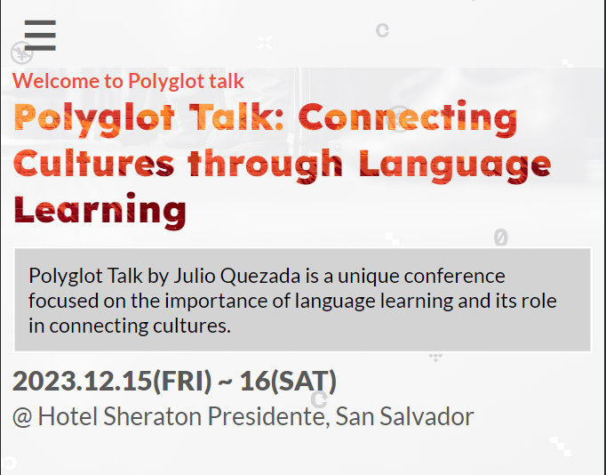

# Polyglot Talk

> A two page promotional site for a talk on language learning and cross cultural connection, built as a semantic HTML and CSS exercise with mobile first design. Deployed on GitHub Pages.

<p>
  
  
  
  
  
</p>

<div align="center">
  
</div>

**Live site:** [alejandroq12.github.io/polyglot-talk](https://alejandroq12.github.io/polyglot-talk/index.html) · **Walkthrough:** [Loom](https://www.loom.com/share/a863f031fa284557b40d31ee47e01fbe)

---

## The Problem

I wanted to practice mobile first responsive design and semantic HTML on a project with a clear content focus, rather than a generic portfolio page or a todo app. I am a polyglot who speaks Spanish, English, and French, and I am learning Chinese, so a site centered on language learning and cross cultural exchange gave me a topic I cared about and content I could write with confidence.

## The Approach

A two page static site: a main page with a conference style event layout, and a secondary about page. Built entirely with semantic HTML, plain CSS with flexbox and media queries, and a small amount of JavaScript for the mobile menu. No framework, no build tooling. The site is deployed on GitHub Pages straight from the repository.

---

## Key Decisions

### Why no framework

For a two page static site, a framework would have added tooling overhead with no user facing benefit. The goal of the exercise was to get fluent with responsive CSS and semantic markup, so removing build steps kept the focus on the language of the web rather than the build system.

### Why mobile first

Conference and event pages are shared overwhelmingly through links people open on their phones. Designing for small screens first, then expanding to tablets and desktops with media queries, produced a layout that degrades gracefully at every size rather than one that was designed for desktop and squeezed into mobile as an afterthought.

### Why semantic HTML strictly

`nav`, `main`, `section`, `article`, `figure`, `footer`. Every tag on the site was chosen for meaning, not for styling hooks. This makes the site accessible to screen readers by default, improves SEO, and produces HTML that reads cleanly when I come back to it months later.

---

## Tech Stack

| Layer | Technology |
|-------|-----------|
| Markup | HTML5, semantic |
| Styling | CSS3 with flexbox and media queries |
| Behavior | Vanilla JavaScript for the mobile menu |
| Linting | ESLint, Stylelint, webhint |
| CI | GitHub Actions |
| Hosting | GitHub Pages |

---

## Running Locally

```bash
git clone https://github.com/Alejandroq12/polyglot-talk.git
cd polyglot-talk
```

Open `index.html` directly in a browser, or serve it with any static server:

```bash
npx serve .
```

### Optional: run the linters

```bash
npm install
npx eslint .
npx stylelint "**/*.css"
npx hint .
```

---

## Project Structure

```
assets/         Images, icons, logo
js/             JavaScript for mobile menu and small interactions
index.html      Main page
about.html      About page
```

---

## What I Learned

Writing two complete pages in strict semantic HTML taught me to think of markup as a meaning layer and CSS as a purely visual one. My earlier projects used `div` for almost everything and relied on class names for structure. Forcing myself to choose between `section`, `article`, and `aside` on every block made me reason about what each piece of content actually *was* before I styled it. That habit has stayed with me: in backend work now, I start with the domain model and the relationships before writing any code, for the same reason.

---

## Roadmap

* Record and embed the actual talk as a video
* Add a simple contact form backed by a serverless function
* Improve Lighthouse accessibility score to 100

---

## About Me

I am Julio Quezada, a backend .NET developer from El Salvador with experience building production systems at national scale. I specialize in C#, ASP.NET Core, and PostgreSQL.

**Open to remote backend roles** across US, EU, and LATAM time zones.

[Portfolio](https://www.quezadajulio.com) · [LinkedIn](https://www.linkedin.com/in/jqdeveloper) · qjuliodev@gmail.com

---

## Acknowledgments

The visual design was inspired by Cindy Shin's "CC Global Summit 2015" concept on Behance, used under the original Creative Commons license. [Design reference](https://www.behance.net/gallery/29845175/CC-Global-Summit-2015).

---

## License

MIT. See [LICENSE](./LICENSE) for details.
